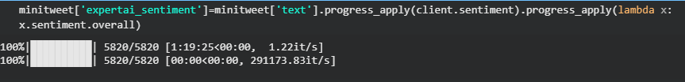

[](https://www.python.org/)[](https://www.expert.ai/)[](https://www.streamlit.io/)[](https://airline-tweets-nlp.herokuapp.com/)[](https://plotly.com/)[](https://pandas.pydata.org/) 


# Airline Tweets NLP
This project is one of my machine learning and data-driven web apps made using Streamlit. 

The goal of this project is to visualize various sentiment and exploratory analysis on tweets about US airlines.


## About Expert.Ai


Expert.ai Edge Natural Language API—or simply **Edge NL API**—provides the same capabilities of the [expert.ai Natural Language API](https://docs.expert.ai/nlapi/latest/), but on premises or on a private cloud.

Python client for the expert.ai Natural Language APIs adds Natural Language understanding capabilities to your Python apps. The client can use either the Cloud based [Natural Language API](https://docs.expert.ai/nlapi/latest/) or a local instance of [Edge NL API](https://docs.expert.ai/edgenlapi/latest/).

### Installation (development)

You can use `pip` to install the library:

```bash
$ pip install expertai-nla
```

### Setup the server

You can download a standard Edge NL API server from the [expert.ai developer portal](https://developer.expert.ai/).
If you don't already have an account, register on the portal, then sign in.
You will find the Edge NL API packages in the **Developer** section of the portal.

If you use [expert.ai Studio](https://docs.expert.ai/studio/latest/ide/), you can create custom Edge NL API servers that deliver the text intelligence engines corresponding to your projects.
You just need to [deploy the project](https://docs.expert.ai/studio/latest/ide/how-to/deploy/).
Custom servers provide both the Natural Language Understanding capabilities of the standard servers and the custom categorization and extraction capabilities you have designed.

The Edge NL API server can be used in both Windows and Linux and the server package includes the startup script for both operating systems:

- Run `runmeWindows.cmd` to start the server on Windows.
- Run `runmeLinux.sh` to start the server on Linux.

### Usage

The Python client code expects expert.ai developer account credentials to be available as environment variables:

- Linux:

```bash
export EAI_USERNAME=YOUR_USER
export EAI_PASSWORD=YOUR_PASSWORD
```

- Windows:

```shell
SET EAI_USERNAME=YOUR_USER
SET EAI_PASSWORD=YOUR_PASSWORD
```

You can also define them inside your code:

```python
import os
os.environ["EAI_USERNAME"] = 'your@account.email'
os.environ["EAI_PASSWORD"] = 'yourpwd'
```

If you don't have an account, sign up on the [developer portal](https://developer.expert.ai/).

## Using Sentimental and Text Analysis Api

Using Streamlit app and ExpertAi to find sentiment Analysis of Airlines tweets from Database and using the interactive tool to predict new sentiment from latest tweets. 

```python
if st.button('Run'):
        document = client.sentiment(text)
        st.write('Sentiment:', document.sentiment.overall)     
else :
  st.text('Write a tweet to get Sentiment Analysis')
        
```
## Preping Dataset
First preparing Dataset so that the query or Visualization and Analysis become faster in Streamlit App.

```python
from tqdm import tqdm
tqdm.pandas()

tweet['expertai_sentiment']=tweet['text'].progress_apply(client.sentiment).progress_apply(lambda x: x.sentiment.overall)

def emo(sentiment):
    if sentiment>2 and sentiment<25 :## emotions
        return 'Happy'
    elif sentiment<-2 and sentiment>-25:
        return 'Sad'
    elif sentiment<-25:
        return 'Awful'
    elif sentiment>25:
        return 'awesome'
    else:
        return 'Meh'

tweet['emotions']=tweet['expertai_sentiment'].progress_apply(emo)
tweet.to_csv('expertaitweets.csv',index=False)
```

## About the Dataset

The dataset was scraped from Twitter in February 2015 and contributors were first asked to classify positive, negative, and neutral tweets, 

followed by categorizing negative reasons (such as "late flight" or "rude service"). 

More details about the dataset can be found  [Kaggle Crowdflow](https://www.kaggle.com/crowdflower/twitter-airline-sentiment)


## References

This project was inspired from Coursera's: [Create Interactive Dashboards with Streamlit and Python](https://www.coursera.org/projects/interactive-dashboards-streamlit-python) guided project.

## Demo

### Checking Expert.ai Edge API


### Checking Sidebars


# Experimental App

I have created entire app with help of Expert Ai API [Experiment](https://gitlab.com/kingabzpro/Airline-Tweets-NLP/blob/main/experiment.py) .

It took me more then 2 hours to train entire Dataset but then it stop due to concetion Erro with API so I reduced the number of rows to train my data again.

[](https://deepnote.com/viewer/github/kingabzpro/NLP-Tweets-Web-App/blob/main/Expert.AI%20file/Dataprep.ipynb)



I will be enhancing my App by adding more NLP features provided by Expert Ai:

- [Relation extraction](https://docs.expert.ai/edgenlapi/latest/guide/relation-extraction/)
- [Deep linguistic analysis](https://docs.expert.ai/edgenlapi/latest/guide/linguistic-analysis/)
- [Document classification](https://docs.expert.ai/edgenlapi/latest/guide/classification/)
- [Information extraction](https://docs.expert.ai/edgenlapi/latest/guide/extraction/)

⭐Do Star it if you like my work⭐ .

> Image curtesy thesis123.com
>
> This guy's Repo have helped me alot so do start him too [richard](https://github.com/richardcsuwandi)
